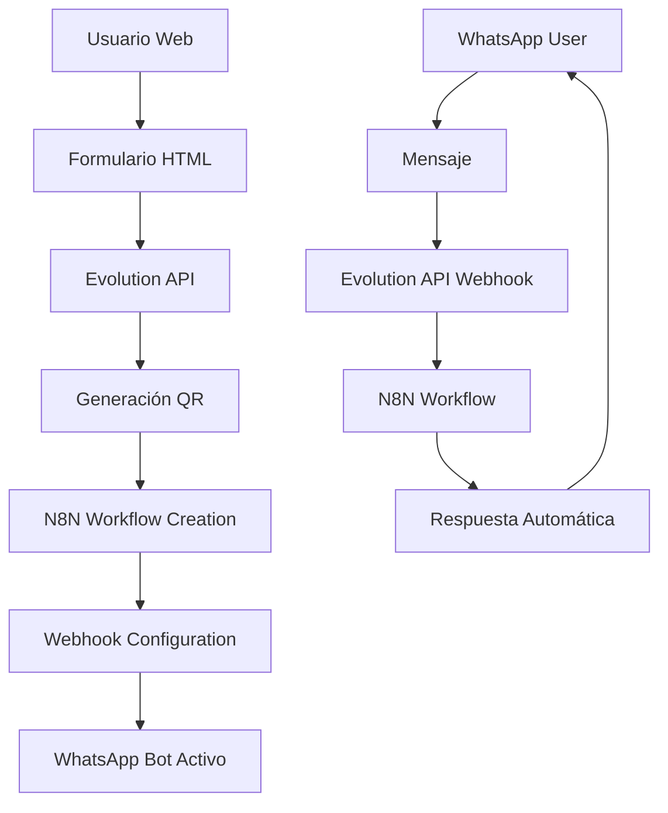

# 🚀 Sistema WhatsApp Business Automatizado

## Documentación Técnica Completa

### 📋 Índice
1. [Descripción General](#descripción-general)
2. [Arquitectura del Sistema](#arquitectura-del-sistema)
3. [Requisitos Previos](#requisitos-previos)
4. [Instalación y Configuración](#instalación-y-configuración)
5. [APIs Utilizadas](#apis-utilizadas)
6. [Flujo de Trabajo](#flujo-de-trabajo)
7. [Plantillas de Chatbot](#plantillas-de-chatbot)
8. [Personalización](#personalización)
9. [Troubleshooting](#troubleshooting)
10. [Seguridad](#seguridad)

---

## 📖 Descripción General

Este sistema funciona como un **orquestador inteligente** que automatiza la configuración completa de un chatbot de WhatsApp Business. Es como una línea de ensamblaje moderna donde cada estación tiene una función específica:

- **Estación 1**: Captura de datos del usuario
- **Estación 2**: Creación de instancia WhatsApp
- **Estación 3**: Generación de código QR
- **Estación 4**: Configuración del chatbot
- **Estación 5**: Conexión de webhooks

### 🎯 Características Principales

- ✅ Interfaz web intuitiva y responsiva
- ✅ Integración automática con Evolution API
- ✅ Creación dinámica de workflows N8N
- ✅ Configuración automática de webhooks
- ✅ Plantillas predefinidas por tipo de negocio
- ✅ Progreso visual en tiempo real
- ✅ Manejo de errores robusto

---

## 🏗️ Arquitectura del Sistema



### 🔄 Flujo de Datos

```
Usuario → Formulario Web → Evolution API → QR Code
                     ↓
             N8N Workflow ← Webhook ← WhatsApp Messages
                     ↓
             Respuestas Automáticas → WhatsApp
```

---

## ⚙️ Requisitos Previos

### 🖥️ Servidor Web
- **HTTPS habilitado** (requerido por WhatsApp)
- **PHP/Node.js/Apache** (cualquier servidor web)
- **Dominio válido** (no IP directa)

### 🔑 APIs Necesarias

#### Evolution API
- **URL Base**: `https://tu-evolution-api.com`
- **API Key**: Token de autenticación
- **Permisos**: Crear instancias, generar QR, configurar webhooks

#### N8N
- **URL Base**: `https://tu-n8n-instance.com`
- **API Key**: Token de autenticación N8N
- **Permisos**: Crear/modificar workflows, activar automations

---

## 🔧 Instalación y Configuración

### Paso 1: Preparar Archivos

```bash
# Crear directorio del proyecto
mkdir whatsapp-business-automation
cd whatsapp-business-automation

# Descargar o crear el archivo HTML
# Guardar como index.html
```

### Paso 2: Configurar Servidor Web

```apache
# .htaccess para Apache
RewriteEngine On
RewriteCond %{HTTPS} off
RewriteRule ^(.*)$ https://%{HTTP_HOST}%{REQUEST_URI} [L,R=301]

# Headers de seguridad
Header always set X-Content-Type-Options nosniff
Header always set X-Frame-Options DENY
Header always set X-XSS-Protection "1; mode=block"
```

### Paso 3: Configurar APIs

```javascript
// En el archivo HTML, sección de configuración
const API_CONFIG = {
    evolution: {
        baseUrl: 'https://tu-evolution-api.com',
        apiKey: 'TU_EVOLUTION_API_KEY',
        instanceName: '' // Se genera automáticamente
    },
    n8n: {
        baseUrl: 'https://tu-n8n-instance.com',
        apiKey: 'TU_N8N_API_KEY',
        workflowId: '' // Se genera automáticamente
    }
};
```

---

## 📡 APIs Utilizadas

### Evolution API

#### Crear Instancia
```http
POST /instance/create
Authorization: Bearer YOUR_API_KEY
Content-Type: application/json

{
    "instanceName": "instance_1234567890",
    "phone": "+5491112345678",
    "webhook": true,
    "webhookByEvents": true
}
```

#### Generar QR Code
```http
GET /instance/connect/{instanceName}
Authorization: Bearer YOUR_API_KEY
```

#### Configurar Webhook
```http
POST /webhook/set/{instanceName}
Authorization: Bearer YOUR_API_KEY
Content-Type: application/json

{
    "webhook": {
        "url": "https://tu-n8n.com/webhook/whatsapp-webhook",
        "enabled": true,
        "events": ["messages.upsert"]
    }
}
```

### N8N API

#### Crear Workflow
```http
POST /api/v1/workflows
Authorization: Bearer YOUR_N8N_API_KEY
Content-Type: application/json

{
    "name": "WhatsApp ChatBot",
    "nodes": [...],
    "active": true
}
```

#### Activar Workflow
```http
PUT /api/v1/workflows/{workflowId}/activate
Authorization: Bearer YOUR_N8N_API_KEY
```

---

## 🔄 Flujo de Trabajo

### Proceso de Configuración (5 Pasos)

#### Paso 1: Conexión con Evolution API
```javascript
async function createEvolutionInstance(phone) {
    const response = await fetch(`${API_CONFIG.evolution.baseUrl}/instance/create`, {
        method: 'POST',
        headers: {
            'Content-Type': 'application/json',
            'Authorization': `Bearer ${API_CONFIG.evolution.apiKey}`
        },
        body: JSON.stringify({
            instanceName: API_CONFIG.evolution.instanceName,
            phone: phone,
            webhook: true
        })
    });
    
    return response.ok;
}
```

#### Paso 2: Generación de QR
```javascript
async function generateQRCode() {
    const response = await fetch(
        `${API_CONFIG.evolution.baseUrl}/instance/connect/${API_CONFIG.evolution.instanceName}`,
        {
            headers: {
                'Authorization': `Bearer ${API_CONFIG.evolution.apiKey}`
            }
        }
    );
    
    const data = await response.json();
    return data.qrCode;
}
```

#### Paso 3: Crear Workflow N8N
```javascript
async function createN8NWorkflow(businessType) {
    const workflowTemplate = BUSINESS_WORKFLOWS[businessType];
    
    const response = await fetch(`${API_CONFIG.n8n.baseUrl}/api/v1/workflows`, {
        method: 'POST',
        headers: {
            'Content-Type': 'application/json',
            'Authorization': `Bearer ${API_CONFIG.n8n.apiKey}`
        },
        body: JSON.stringify(workflowTemplate)
    });
    
    const data = await response.json();
    API_CONFIG.n8n.workflowId = data.id;
    return response.ok;
}
```

#### Paso 4: Configurar Webhook
```javascript
async function setupWebhook() {
    const webhookUrl = `${API_CONFIG.n8n.baseUrl}/webhook/whatsapp-webhook`;
    
    const response = await fetch(
        `${API_CONFIG.evolution.baseUrl}/webhook/set/${API_CONFIG.evolution.instanceName}`,
        {
            method: 'POST',
            headers: {
                'Content-Type': 'application/json',
                'Authorization': `Bearer ${API_CONFIG.evolution.apiKey}`
            },
            body: JSON.stringify({
                webhook: {
                    url: webhookUrl,
                    enabled: true,
                    events: ['messages.upsert']
                }
            })
        }
    );
    
    return webhookUrl;
}
```

#### Paso 5: Finalización
```javascript
async function finalizeConfiguration(webhookUrl) {
    // Configuraciones adicionales
    console.log('✅ Configuración completada');
    console.log('📞 Instancia:', API_CONFIG.evolution.instanceName);
    console.log('🔗 Webhook:', webhookUrl);
    console.log('🤖 Workflow ID:', API_CONFIG.n8n.workflowId);
}
```

---

## 🤖 Plantillas de Chatbot

### Restaurante
```javascript
const restaurantBot = {
    name: "Restaurante ChatBot",
    responses: {
        menu: "🍽️ ¡Hola! Aquí tienes nuestro menú:\n\n🍕 Pizzas: $15-25\n🍔 Hamburguesas: $12-18\n🥗 Ensaladas: $8-12\n\n¿Qué te gustaría ordenar?",
        greeting: "¡Hola! 👋 Bienvenido a nuestro restaurante. Escribe 'menu' para ver nuestras opciones.",
        default: "Gracias por tu mensaje. Un momento, te conectamos con nuestro equipo. 🍽️"
    }
};
```

### Tienda/Retail
```javascript
const retailBot = {
    name: "Tienda ChatBot",
    responses: {
        catalog: "🛍️ ¡Hola! Aquí tienes nuestro catálogo:\n\n👕 Ropa: 20% OFF\n👟 Calzado: Nuevas llegadas\n🎒 Accesorios: Promoción 2x1\n\n¿Qué producto te interesa?",
        greeting: "¡Hola! 👋 Bienvenido a nuestra tienda. Escribe 'catalogo' para ver nuestros productos.",
        default: "Gracias por tu consulta. Te conectamos con ventas. 🛒"
    }
};
```

### Servicios
```javascript
const servicesBot = {
    name: "Servicios ChatBot",
    responses: {
        services: "🛠️ ¡Hola! Nuestros servicios:\n\n⚡ Mantenimiento\n🔧 Reparaciones\n📋 Consultoría\n\n¿En qué podemos ayudarte?",
        greeting: "¡Hola! 👋 ¿Necesitas algún servicio? Escribe 'servicios' para ver nuestras opciones.",
        default: "Gracias por contactarnos. Te conectamos con nuestro equipo técnico. 🛠️"
    }
};
```

### Farmacia (Ejemplo de Personalización)
```javascript
const pharmacyBot = {
    name: "Farmacia ChatBot",
    responses: {
        medication: "💊 Hola! ¿Qué medicamento necesitas?\n\n📋 Puedes enviar tu receta\n🚚 Hacemos delivery\n⏰ Horario: 8-22hs",
        greeting: "¡Hola! 👋 Bienvenido a nuestra farmacia. ¿En qué podemos ayudarte?",
        default: "Gracias por tu consulta. Te conectamos con nuestro farmacéutico. 💊"
    }
};
```

---

## 🎨 Personalización

### Agregar Nuevo Tipo de Negocio

1. **Definir Plantilla**:
```javascript
BUSINESS_WORKFLOWS.consultorio = {
    name: "Consultorio Médico ChatBot",
    nodes: [
        {
            type: "webhook",
            name: "WhatsApp Webhook",
            parameters: {
                path: "/whatsapp-webhook",
                method: "POST"
            }
        },
        {
            type: "function",
            name: "Procesar Mensaje",
            parameters: {
                functionCode: `
                    const message = items[0].json.body;
                    const phone = items[0].json.from;
                    
                    let response = "";
                    if (message.toLowerCase().includes("cita") || message.toLowerCase().includes("turno")) {
                        response = "👩‍⚕️ Para agendar una cita:\n\n📅 Lunes a Viernes: 9-17hs\n📞 Llamanos: (011) 1234-5678\n💻 Web: www.consultorio.com\n\n¿Qué especialidad necesitas?";
                    } else if (message.toLowerCase().includes("hola")) {
                        response = "¡Hola! 👋 ¿Necesitas agendar una consulta? Escribe 'cita' para más información.";
                    } else {
                        response = "Gracias por contactarnos. Te conectamos con recepción. 👩‍⚕️";
                    }
                    
                    return [{
                        json: {
                            to: phone,
                            message: response
                        }
                    }];
                `
            }
        }
    ]
};
```

2. **Agregar al HTML**:
```html
<option value="consultorio">Consultorio Médico</option>
```

### Personalizar Respuestas

```javascript
// Modificar el código de función en el workflow
const customResponses = {
    horarios: "🕐 Nuestros horarios:\n\nLun-Vie: 9:00-18:00\nSáb: 9:00-13:00\nDom: Cerrado",
    ubicacion: "📍 Nos encontramos en:\nAv. Corrientes 1234\nBuenos Aires, Argentina\n\n🚇 Cerca del subte Línea B",
    precios: "💰 Consulta nuestros precios:\n\n💊 Consulta general: $3000\n🩺 Especialista: $4500\n📋 Estudios: Consultar"
};
```

### Modificar Estilos CSS

```css
/* Cambiar colores principales */
:root {
    --primary-color: #25d366;
    --secondary-color: #128c7e;
    --accent-color: #dcf8c6;
    --text-color: #2d3748;
    --bg-gradient: linear-gradient(135deg, #667eea 0%, #764ba2 100%);
}

/* Personalizar botones */
.btn {
    background: linear-gradient(135deg, var(--primary-color) 0%, var(--secondary-color) 100%);
    /* ... resto de estilos */
}

/* Personalizar contenedor principal */
.container {
    max-width: 800px; /* Hacer más ancho */
    padding: 50px;    /* Más padding */
    /* ... resto de estilos */
}
```

---

## 🐛 Troubleshooting

### Problemas Comunes

#### Error: "No se puede crear instancia"
```
Causa: API Key inválida o URL incorrecta
Solución:
1. Verificar API Key de Evolution API
2. Comprobar URL base (debe incluir https://)
3. Verificar permisos del token
```

#### Error: "QR Code no se genera"
```
Causa: Instancia no se creó correctamente
Solución:
1. Verificar logs de Evolution API
2. Comprobar que la instancia existe
3. Reintentar después de 30 segundos
```

#### Error: "Webhook no funciona"
```
Causa: N8N no es accesible desde Evolution API
Solución:
1. Verificar que N8N sea público (no localhost)
2. Comprobar firewall/puertos
3. Verificar certificado SSL
```

#### Error: "Bot no responde"
```
Causa: Workflow no está activo o mal configurado
Solución:
1. Verificar que el workflow esté activo en N8N
2. Comprobar logs del workflow
3. Verificar formato del webhook
```

### Logs de Debug

```javascript
// Activar logs detallados
const DEBUG = true;

function debugLog(message, data = null) {
    if (DEBUG) {
        console.log(`[DEBUG] ${new Date().toISOString()}: ${message}`);
        if (data) console.log(data);
    }
}

// Usar en las funciones
async function createEvolutionInstance(phone) {
    debugLog('Iniciando creación de instancia', { phone });
    
    try {
        const response = await fetch(/* ... */);
        debugLog('Respuesta de Evolution API', {
            status: response.status,
            ok: response.ok
        });
        
        // ... resto del código
    } catch (error) {
        debugLog('Error en createEvolutionInstance', error);
        throw error;
    }
}
```

### Validaciones de Entrada

```javascript
function validatePhone(phone) {
    const phoneRegex = /^\+\d{10,15}$/;
    if (!phoneRegex.test(phone)) {
        throw new Error('Formato de teléfono inválido. Use +5491112345678');
    }
}

function validateApiKeys() {
    if (!API_CONFIG.evolution.apiKey || API_CONFIG.evolution.apiKey.length < 10) {
        throw new Error('API Key de Evolution API inválida');
    }
    
    if (!API_CONFIG.n8n.apiKey || API_CONFIG.n8n.apiKey.length < 10) {
        throw new Error('API Key de N8N inválida');
    }
}
```

---

## 🔒 Seguridad

### Validación de Datos

```javascript
// Sanitizar entrada de usuario
function sanitizeInput(input) {
    return input
        .replace(/[<>]/g, '') // Remover HTML
        .trim()
        .substring(0, 100);   // Limitar longitud
}

// Validar API Keys
function validateApiKey(key) {
    const keyRegex = /^[a-zA-Z0-9_-]{20,}$/;
    return keyRegex.test(key);
}
```

### Headers de Seguridad

```javascript
// Agregar al inicio de las peticiones
const secureHeaders = {
    'Content-Type': 'application/json',
    'X-Requested-With': 'XMLHttpRequest',
    'Authorization': `Bearer ${apiKey}`
};
```

### Rate Limiting

```javascript
class RateLimiter {
    constructor(maxRequests = 10, timeWindow = 60000) {
        this.requests = [];
        this.maxRequests = maxRequests;
        this.timeWindow = timeWindow;
    }
    
    canMakeRequest() {
        const now = Date.now();
        this.requests = this.requests.filter(time => now - time < this.timeWindow);
        
        if (this.requests.length >= this.maxRequests) {
            return false;
        }
        
        this.requests.push(now);
        return true;
    }
}

const rateLimiter = new RateLimiter();

// Usar antes de cada petición
if (!rateLimiter.canMakeRequest()) {
    throw new Error('Demasiadas peticiones. Intenta más tarde.');
}
```

### Encriptación de API Keys

```javascript
// Simple ofuscación (para frontend)
function obfuscateKey(key) {
    return btoa(key).split('').reverse().join('');
}

function deobfuscateKey(obfuscatedKey) {
    return atob(obfuscatedKey.split('').reverse().join(''));
}

// Mejor práctica: usar variables de entorno en backend
// process.env.EVOLUTION_API_KEY
// process.env.N8N_API_KEY
```

---

## 📈 Métricas y Monitoreo

### Tracking de Eventos

```javascript
// Analytics básico
class Analytics {
    static track(event, data = {}) {
        const eventData = {
            event,
            timestamp: new Date().toISOString(),
            data,
            userAgent: navigator.userAgent,
            url: window.location.href
        };
        
        console.log('Analytics:', eventData);
        
        // Enviar a tu servicio de analytics
        // fetch('/analytics', { method: 'POST', body: JSON.stringify(eventData) });
    }
}

// Usar en el código
Analytics.track('qr_generated', { businessType, phone });
Analytics.track('workflow_created', { workflowId, businessType });
Analytics.track('configuration_completed', { instanceName, webhookUrl });
```

### Health Check

```javascript
async function healthCheck() {
    const checks = {
        evolution: false,
        n8n: false,
        webhook: false
    };
    
    try {
        // Check Evolution API
        const evolutionResponse = await fetch(`${API_CONFIG.evolution.baseUrl}/health`);
        checks.evolution = evolutionResponse.ok;
        
        // Check N8N
        const n8nResponse = await fetch(`${API_CONFIG.n8n.baseUrl}/healthz`);
        checks.n8n = n8nResponse.ok;
        
        // Check Webhook
        checks.webhook = checks.evolution && checks.n8n;
        
    } catch (error) {
        console.error('Health check failed:', error);
    }
    
    return checks;
}
```

---

## 🚀 Deployment

### Producción

1. **Optimizar Código**:
```javascript
// Minificar CSS y JS
// Comprimir imágenes
// Habilitar cache del navegador
```

2. **Configurar HTTPS**:
```apache
# Apache
SSLEngine on
SSLCertificateFile /path/to/certificate.crt
SSLCertificateKeyFile /path/to/private.key
```

3. **Variables de Entorno**:
```bash
# .env
EVOLUTION_API_URL=https://tu-evolution-api.com
EVOLUTION_API_KEY=tu_api_key
N8N_API_URL=https://tu-n8n-instance.com
N8N_API_KEY=tu_n8n_key
```

### Escalabilidad

```javascript
// Configuración para múltiples instancias
const INSTANCES_CONFIG = {
    maxInstances: 100,
    cleanupInterval: 3600000, // 1 hora
    instanceTTL: 86400000     // 24 horas
};

class InstanceManager {
    constructor() {
        this.instances = new Map();
        this.setupCleanup();
    }
    
    createInstance(phone, businessType) {
        const instanceId = `instance_${Date.now()}_${Math.random()}`;
        this.instances.set(instanceId, {
            phone,
            businessType,
            createdAt: Date.now(),
            status: 'creating'
        });
        return instanceId;
    }
    
    setupCleanup() {
        setInterval(() => {
            const now = Date.now();
            for (const [id, instance] of this.instances) {
                if (now - instance.createdAt > INSTANCES_CONFIG.instanceTTL) {
                    this.instances.delete(id);
                }
            }
        }, INSTANCES_CONFIG.cleanupInterval);
    }
}
```

---

## 📞 Soporte

### Contacto
- **Email**: soporte@tudominio.com
- **GitHub**: https://github.com/tu-usuario/whatsapp-business-automation
- **Documentación**: https://docs.tudominio.com

### Contribuciones
Las contribuciones son bienvenidas. Por favor:
1. Fork el repositorio
2. Crea una rama para tu feature
3. Envía un pull request con descripción detallada

### Licencia
MIT License - Ver archivo LICENSE para más detalles.

---

**¡Tu sistema WhatsApp Business está listo para automatizar conversaciones y crecer tu negocio! 🚀**